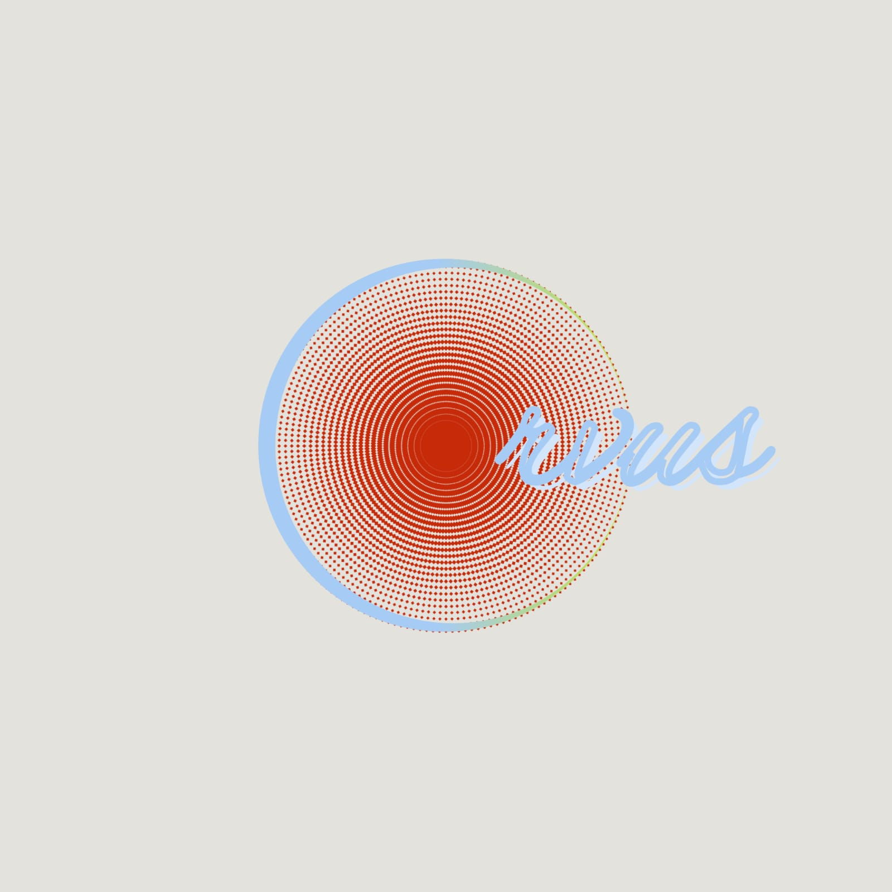
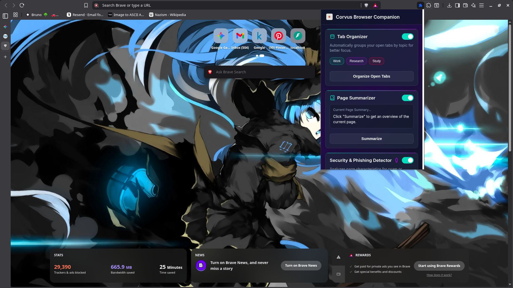
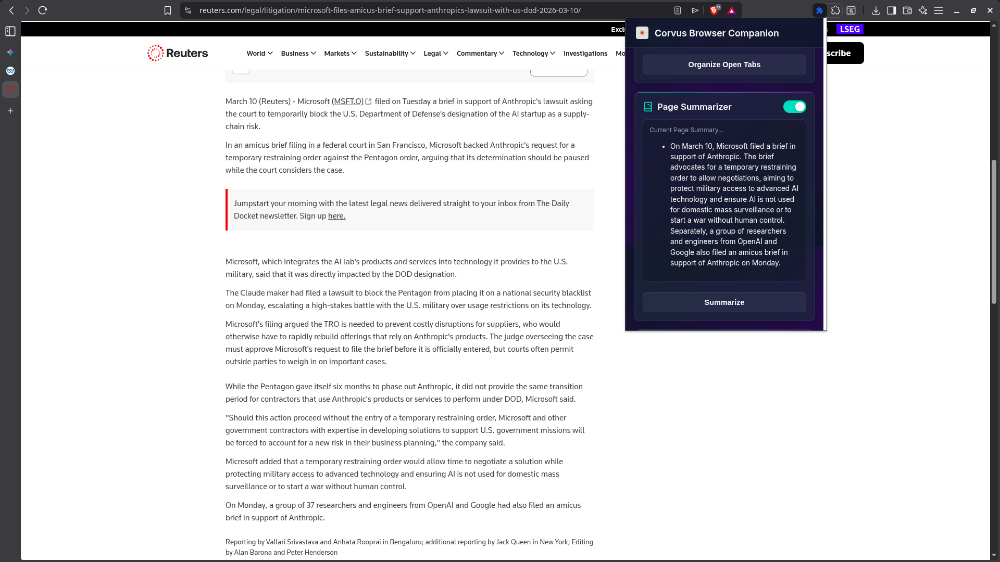

# Corvus: The Black & Red AI Suite

**Corvus** is a highly specialized, Cyber-Goth-themed Chromium browser extension paired with an intelligent Python FastAPI backend. It replaces generic browsing workflows with a brutalist, speed-first AI suite customized for power users.

It combines local machine learning with cloud-based LLM synthesis to protect against phishing attacks, instantly chunk and summarize heavy reading materials, and aggressively organize browser tab chaos into strict structural "Loot", "Intel", or "Code" categories.

---

## 🛠 Built By Team: Free DDR5
* **Soumili Das** — UI/Frontend Developer
* **Sk Arif Ali** — ML Engineer, System Architect, and Backend Developer

---

## 📸 Core Features & Architecture

### 🛡️ Phishing Sentry (Real-Time Protection)
Background real-time evaluation of all visited URLs. It utilizes an optimized, on-device ONNX `DistilBERT-base-uncased-phishing-url` model within the backend. If a URL violates the strict threshold (>0.85 risk), the DOM is aggressively hijacked with an un-scrollable `#FF0000` (Blood Red) / `#000000` (Pitch Black) warning overlay.

### 🗂️ Tab Dominion (AI Organization)
Drops Chrome's default categorization by scraping active tab states, dispatching the DOM snapshot to Gemini 2.5 Flash, and mapping the resulting pure JSON tree back into Chrome Tab Groups with short, aggressive terminal naming conventions.

### 🧠 RAG Summarization (Deep Reading)
Deep-reads heavy articles by isolating pure textual context using DOM sanitization routines, chunking data into an in-memory ChromaDB instance (`all-MiniLM-L6-v2`), and injecting the top `n_results` to Gemini for instant, ruthless synthesis.

---

## ⚙️ Under The Hood
- **TypeScript & esbuild Frontend:** The DOM interactions and Chrome service workers are strictly typed and rapidly bundled via `esbuild`.
- **GZip & Debounced IO:** All inter-network JSON transfers are zipped, and actions are properly batched to prevent pipeline flooding.

---

## 🚀 Quickstart

### Backend (`/backend`)
1. `pip install -r requirements.txt`
2. Populate `.env` with `GEMINI_API_KEY="..."`
3. Execute `python setup.py` to bake local HuggingFace models to ONNX.
4. Ignite the nest: `uvicorn app.main:app --reload`

### Frontend (`/extension`)
1. `npm install`
2. `npm run build`
3. In Chrome, navigate to `chrome://extensions/` -> Enable **Developer Mode** -> **"Load unpacked"** and select the `/extension/` directory. 
4. Click the dark Corvus icon to deploy the AI.

_Built with FastAPI, Chrome MV3 APIs, and Google GenAI._
